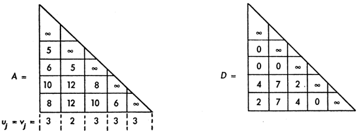
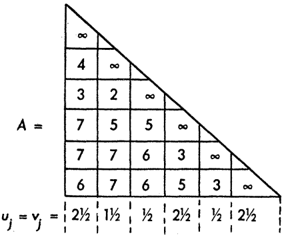
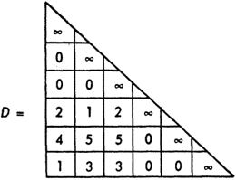
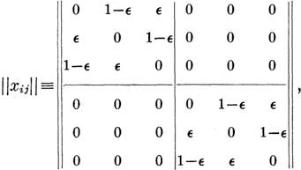
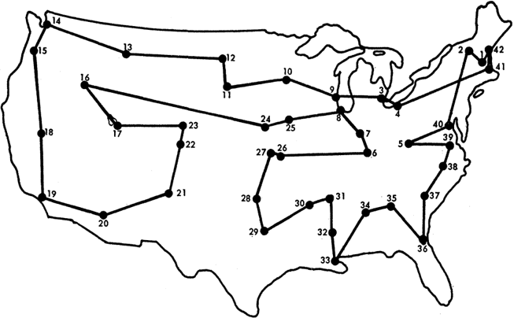
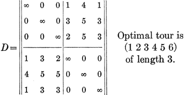
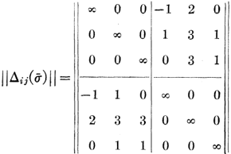

The Traveling-Salesman Problem

Author(s): Merrill M. Flood

Source: Operations Research, Vol. 4, No. 1 (Feb., 1956), pp. 61-75

Published by: INFORMS

Stable URL:

http://www.jstor.org/stable/167517 .

Accessed: 09/05/2014 16:01

Your use of the JSTOR archive indicates your acceptance of the Terms &amp; Conditions of Use, available at . http://www.jstor.org/page/info/about/policies/terms.jsp

.

JSTOR is a not-for-profit service that helps scholars, researchers, and students discover, use, and build upon a wide range of content in a trusted digital archive. We use information technology and tools to increase productivity and facilitate new forms of scholarship. For more information about JSTOR, please contact support@jstor.org.

.

INFORMS is collaborating with JSTOR to digitize, preserve and extend access to Operations Research.

## THE  TRAVELING-SALESMAN PROBLEM

## MERRILL M.  FLOOD

Columbia  University, New  York,  New  York (Received October 3, 1955)

THE TRAVELING-SALESMAN  PROBLEM  is that  of finding a permutation P = (1 i2  i3 * in) of the integers from 1 through n that  minimizes the  quantity ali2+ai2 i +ai3i4 + *  +as.,

where the  a,,  are a given set of real numbers. More accurately, since there are only  (n-1)  ! possibilities to  consider, the problem is to find an efficient method for choosing a minimizing permutation.

The  problem takes  its  name from the fact  that  a  salesman  wishing to travel  by  shortest  total  distance  from his  home  to  each  of  n-1 specified cities, and then return home, could use such a method if he were given the distances  aXx: etween  each  pair of  cities  on his tour. b Or, if  the salesman desired  the  shortest  total  travel  time,  the  a,, would  represent the  individual travel times.

This problem was posed, in 1934, by Hassler Whitney in a seminar talk at  Princeton  University. There  are as  yet  no  acceptable  computational methods, and surprisingly few mathematical results relative to the problem.

The  problem is  closely  related  to  several  considered by  Hamilton,  in which he was concerned with finding the number of different tours possible over a specified configuration. One of these problems, which Ball1 termed the Hamiltonian Game, "consists in the determination of a route along the edges of a regular  dodecahedron which will pass once and only once through every  angular point." Ball  also  discusses  the  relationships  between  the Hamiltonian  Game and other unicursal problems. K6nig2 discusses some of  these  same problems under the  heading Hamiltonian  Lines. I  am  indebted  to  A.  W.  Tucker for calling these  connections to  my  attention,  in 1937, when I was struggling with the problem in connection with a schoolbus routing study in New  Jersey.

The problem is also closely related to the personnel-assignment  problem, which differs from the  traveling-salesman problem only in  that  the  allowable permutations P  may also be noncyclic. In its  most familiar application  to  personnel  management,3 the  assignment  problem  is  to  assign  N men optimally to N  different jobs. In this application, it is supposed that a  numerical performance rating is  given  for each of the  N2 man-job combinations and an optimal assignment is one that  minimizes the  sum of the N  applicable ratings. For example, the ratings might be estimated  times, or costs, for the various man-job combinations.

The personnel-assignment problem is mathematically  equivalent  to the so-called transportation  problem.3  In its most familiar application to transportation  management,  the  transportation  problem4 is  to  redistribute  a fleet  of N  identical  carriers optimally in  given proportions at  a new set  of stations. In this  application, it  is supposed that  a numerical performance rating is  given for moving a  carrier from each old station  to  any  new  one and  an  optimal  routing is  one  that  minimizes  the  sum  of  the  applicable ratings. For example, the ratings might be estimated  times,  or distances, for  the  various  station-to-station movements  and  the  carriers might  be tankers, pallets, freight cars, or other such vehicles.

The  assignment  and  transportation  cases  are  special  applications  for the distribution  problem  as formulated originally by Hitchcock,6 in 1941, and independently by Kantorovitch7 at about the same time. The  Hitchcock distribution problem is to  find a set  of values  of the  mn real variables xij, subject to the following conditions:

<!-- formula-not-decoded -->

where m, n, ri, cj, and dij are given positive integers withi E Cj E =-=N. The  quantities  dii  represent the  known performance ratings in the  assignment and transportation problems.

In  the  transportation  case,  the  quantity  ri  represents the  number  of carriers initially  at  old  station  i  and  cj  represents  the  total  number  of carriers to  be  routed  to  new  station  j  from  all  the  m  old  stations. The solution for xj  gives  the  number of carriers to  be moved  from old station i  to  new station j  in the  optimal routing.

In  the  assignment  case, the  men are separated into  m  categories such that  each  man has  the  same ratings as  every  other  man in  his  category; the  quantity  ri  represents the  number  of  men  in  category  i. Similarly, the jobs are grouped into n classes, such that  the ratings of all men are the same for every job in a class; the  quantity  cj represents the number of jobs in  class j. The  solution  for  Xij  gives  the  number  of  men  of  category  i that  are placed on jobs of class j  in the optimal assignment.

In  another version  of  the  distribution  problem  (commonly  also  called the  transportation  problem),  ri  represents  the  (monthly)  production  capacity  of  plant  i, cj represents the  (monthly)  demand  of  warehouse  or customer j,  and  dij  represents  the  coinbined  unit  cost  of  production  in plant  i  and  shipment  to  j. The  problem is  to  supply  the  warehouses at minimum  cost. If production  capacity  exceeds  demand,  cn  is  used  to represent the total  excess and the  xi,  take up the slack in a fictitious warehouse that  can be supplied at  no  cost  (din-=O).  Then  the  solution  determines  the  percentage  of  capacity  at  which  each  plant  can  be  most  economically operated as well as the  optimum routing to  customers.

Both  the  assignment  and  transportation  problems  are  stated  equally well,  as  is  the  distribution  problem also,  as  that  of  finding a  doubly  stochastic  square  matrix  llxijxi  of  order N  such  that &gt;  xij  dij  =  miniimum. This  formulation  merely omits  taking  explicit  notice  of identical  rows, or columns, of the rating matrix  lldijll. Algebraically, this becomes the problem of finding real  xij  subject to  the  conditions

<!-- formula-not-decoded -->

It  is  also  easily  shown  that  there  is  a  solution  of  this  problem such  that xij2 =xi, which means that Xllxijll  is  a  permutation  matrix-that is, X  is a square matrix whose elements are all null or unity  and with  exactly one unit  element in each row and in each column. A permutation matrix X  that  solves  this  distribution  problem also  solves  the  traveling-salesman problem, with distance matrix  fldcijl,  f and only if no power of X  less than i the  Nth  is the unit  matrix-in other words X  must be cyclic. These considerations provide us writh  a useful alternative  statement  of the  traxvelingsalesman  problem,  as  follows: Find  a  cyclic permutation matrix X  such that trace(XD) =  minimum, where  D is  a given square  matrix. The distribution  problem  is  similarly  stated  as: Find  a  permutation matrix X  such that trace(XD) =  minimum, where D  is  a  given square matrix. (The  trace of a matrix is the sum of the elements on the main diagonal.)

The  distribution  problem  is,  of  course,  a  special  case  of  the  linearprogramming problem. The  linear-programming problem  is,  in  turn,  a special case of that  of finding a nonnegative  solution for a system  of linear algebraic equations. There is now considerable literature dealing with  all these  problems, and  other variants,  including equivalent  problems arising in  the  theory  of  matrix  games. Some  of  the  techniques  from  this  area have  been used  by  Dantzig,  Fulkerson,  and  Johnson8 in  their  paper presenting  a  solution  of  the  traveling-salesman  problem  for  an  actual  case including Washington, D.  C. and one city from each of the 48 states.

Tjalling  Koopmnans  first brought  to  my  attention  the  possibility  of  a connection  between  the  traveling-salesman  problem  and  the  distribution problem, at  the  time  of  the  1948 meeting  of the  International  Statistical Institute, in  connection  with  his  pioneering  paper4 on  the  distribution (transportation)  problem. The  present  author9  solved the degenierate case  of  the  distribution  problem, and  hence  also  the  assignment  problem as  a  special  case  of  degeneracy,  as  an  extension  of  the  graph-theoretic methods employed by  Koopmans and Reiter"'  for the nondegenerate case. Julia Robinson"1  solved the assignment problem while searching for a solution  to  the  traveling-salesman problem, and first made clear the  nature of the relation between the two problems.

Very recent mathematical  work on the  traveling-salesman problem by

I.  Heller,12  H.  WV.  uhn,13  and others8  indicates  that  the problem is fundaK mentally  complex. It  seems  very  likely  that  quite  a  different approach from any yet used mnay e required for successful treatment of the problem. b In fact,  there may well be no general method for treating the problem and impossibility  results would also be valuable.

There  is  one  useful  general  theorem,  which  is  quickly  discovered  by each one who considers the traveling-salesman problem. In  the  euclidean plane it  states  simply  that  the  minimal tour  does not  intersect  itself,  and this  intersection  condition  generalizes easily  for arbitrary aaf. The  Rand Corporation offered a prize for anyone  who  could contribute  another  significant theorem pertaining to  the  traveling-salesman problem, but,  to  the best  of my  knowledge, no awards were made. There have  been countless conjectures,  but  each  has  fallen  victim  to  a  counterexample. In  brief, the problem may be fairly considered open.

The present paper gives a method for solving the assignment  (distribution)  problem and shows how this  method  may  be used  effectively  in  the initial  preparation  of  a  traveling-salesman  problem  for  subsequent  computations. Some techniques  that  are useful in  seeking  good approximate solutions, especially in the symmetric case, are given. The  computational techniques  due  to  Dantzig,  Fulkerson,  and  Johnson   are  discussed,  and 8 applied to  an  example. The  various  mathematical  points  are illustrated by  ni-umerical xamples, including an analysis  of the  results  of application e of  the  approximate methods  to  the  49-city  case treated  by  Dantzig  et al. Connections are pointed  out  between  the  traveling-salesman problem and various  other  mathematical  programming  problems,  and  several  of  the more important industrial and management applications of the  results are cited.

## APPLICATIONS

THE  SALESMAN'S PROBLEM of  choosing a short travel route is typical  of one class of practical situations  represented by the traveling-salesman problem. It  is  easy  to  think  of other routing applications,  and that  for a school bus making specified stops each trip is one example.

Another familiar situation, in which a solution of the traveling-salesman problem would be useful, is that  of scheduling a machine over a given  set of repeated operations. For example, a maehine tool  may  be required to perform a  speeified set  of  operations repetitively,  and  the  operator's task is  to  choose a sequential  order for the  operations that  minimizes the  cycle time for the set.

The  maehine-seheduling  example  is  very  similar to  an  important  design problem, also represented by  the traveling-salesman conditions. The designer's task,  say  in laying  out  an automatic  television-assembly  line,  is to  so  route  the  path  of  ehassis  among  the  assembly  stations  that  travel

time is minimized--or,  equivalently,  so that  production rate is maximized. In actual practice, in this and in other applications, other factors are almost sure to  enter into  consideratioln. For example, there will  often  be precedence  conditions  that  prohibit  certain  sequences  of  assembly  operations from occurring. Sometimes  these  extra  factors  make  the  solution  easier to  find,  by  eliminating  troublesome  cases,  and  sometimes  the  solution  is made more difficult by  ruling out  alternatives  that  would otherwise easily be shown to be optimal. These design applications are particularly attractive,  however,  because  even  small  but  real percentage  improvements  are well worth-while because of the highly repetitive yet  essentially permanent character of the  operation.

George Feeney,  in a seminar talk  at  Columbia University  in  1954, reported on one interesting case of machine-tool operation in which the operator  appeared to  stay  rather closely  with  the  rule that  the  next  operation on the  machine should be the  one requiring the  least  setup time. This  is analogous to the salesman always going next to the closest city not already visited. The  rule is  not  optimal,  of  course, but  it  may  well  be  the  most practical  one for  an  operator who  does  not  even  have  good  explicit  estimates of average setup times-especially so when there is any uncertainty as to the precise set of operations to be performed during the cycle.

It  may be of some interest to  compare the length of optimal tour found among the  49  cities  by  Dantzig  et al.  with  that  which would be followed by  a  salesman living  in Washington,  D.  C.,  who  always  went  next  to  the closest  city  not  already  visited. This  turns  out  to  be  904  units  against 699 units,  or an increase of nearly 30 per cent. It  seems likely that  a considerably  better  route  than  that  produced  by  the  operator's rule  could usually  be  found  quite  easily,  and  it  also  seems  likely  that  rather simple methods  could be found to  yield  a  tour much nearer optimal  then  30 per cent. However,  even  a  few  per  cent  gain  would  be  well  worth-while  in some cases, so the problem does seem to have practical importance as well as mathematical interest.

## MATHEMATICAL BACKGROUND

IT  WILL  BE  HELPFUL  to  start  with  a  solution  of  the  assignment  problem, as an introduction to the notation aiid methods to be used in discussing the traveling-salesman  problem. The  approach used  is  essentially  the  same as  that of  Kuhn,14 and  rests  on  the  following  fundamental  theorem  of K6nig2 as stated  by Ergervary:Th

KONIG'S THEOREM: If the elements of  a  matrix are partly zeros, and partly numbers different  from zero, then the minimum number of  lines that contain all  the nonzero elements  of the matrix is  equal to the maximum number of nonzero elements  that can be chQsen  with no  two on the tsame  line,

In  this  paper, the  word 'line' applies both  to  the  rows and the  columns of a matrix.

The  assignment  problem requires that  a  set  of  n  elements  be  chosen from the  square matrix A =  laijl  of  order n,  with  no  two  elements  in  the same  line,  such  that  their  sum  is  minimal. This  can  be  written  algebraically as follows: Find real xij  such that

<!-- formula-not-decoded -->

<!-- formula-not-decoded -->

<!-- formula-not-decoded -->

where  the  aij  are  given  real  numbers. Actually,  we  shall  be  interested only  in  those  cases  where the  aUj are nonnegative  integers;  but  it  can  be shown'2  by  continuity  considerations that  this  restriction leads  to  no  real loss  in  generality. It  is  also  well  known that  (1)  can be  replaced, in  the assignment  problem, by the less restrictive condition

<!-- formula-not-decoded -->

The  traveling-salesman problem can be represented by  conditions  (1), (2),  (3),  (5),  and  (6),  where

<!-- formula-not-decoded -->

and where (il  i2 ir) is  a permutation of the integers  1 through r, and

<!-- formula-not-decoded -->

UJnfortunately,  the  condition  (4)  can  not  be  used  to  replace  (1)  for  the traveling-salesman problem, and this  is  the  most  obvious  evidence  of the substantial difference between the two  problems.

It  is  an important fact  that  the  solution  of neither problem is  changed by replacing aij  by  dij,  where

<!-- formula-not-decoded -->

and  where  ui  and  vj  are  arbitrary  constants. This  fact,  together  with K6nig's theorem, is enough to  establish a reasonably simple algorithm for solving the assignment problem-as has been shown by Kuhn.4 In brief outline, the algorithm has the following  steps:

Step  1. Subtract the  smallest  element  in A  from each element,  obtaining  a matrix  A1  with nonnegative  elements  and at least one null element.

Step  2. Find a minimal  set Si  of lines, ni in number,  that includes  all null elements  of A1. If  ni  =n  there  is a set Qf   null elements,  no two Qf  whi h are  in n

the same line, and the elements  of A in these n positions  constitute  the required solution.

Step  3. If n, &lt;n, let hi denote  the smallest  element  of A1  not in any line of S.1 Add  hi to each  element  of A1  that is also  in a line of S1 and  subtract  h1  from  every element  of A1. Call  the resulting matrix  A2.

Step  4. Repeat Steps 2 and 3, starting  with A2, until at some  stage  nk= n. This process  must terminate  since  the elements  of Ak are always  nonnegative  but decreasing  in total sum after each application  of Step 3.

There  are  rather  simple  systematic  graphical procedures for  finding  the set  Sk at  each  stage,  and also for finding the  final set  of n  null  elements, but  these  will  not  be  discussed  here  because  they  are not  important  for present purposes.

We  shall now  direct  our attention  to  the  traveling-salesman problem. We may clearly replace condition (6) by an equivalent  condition:

<!-- formula-not-decoded -->

In  other  words, if  we  assume  aii  to  be  arbitrarily large  this  will  require that xii=  O  in this solution.

The end result of the application of the assignment algorithm is a transformed matrix

<!-- formula-not-decoded -->

which, after suitable symmetric permutations of rows and columns, is such that

- (a)  every element of each submatrix D,a  is positive if  a#g:,B,
- (b)  every diagonal element of the submatrix Daa&lt;  s simply a transform i of some diagonal infinite element of A,  and
- (c)  every  element  immediately  above  the  diagonal of Dtaa  is  zero, and the  element in the last  row and first column of Doaoa   also zero. is

Since there is  no loss in  generality in  restricting our attention  to  matrices satisfying  (9),  because  every  matrix  A  can  be  reduced  to  this  form  by means of a transformation (7)  that  leaves  the  solutions  of both  the  problems unaffected, we will suppose henceforth that  A =D is  in  this  form.

It  is  obvious  that  oue  solution  of  the  assignment  problem is  obtained by  choosing the  elements in  the  'slants' of all the  submatrices D  a,&lt;  where a  slant  is  defined  to  consist  of  all  the  elements  immediately  above  the diagonal together  with  the  one in  the  lower left-hand  corner of  a  matrix.

If  p  = 1, so that  the  slant  of D  solves the  assignmenit  problem, then  the slant  of D  also solves  the  traveling-salesman problem. In  fact,  there is  a solution of the  assignment problem that  also solves the  traveling-salesman problem if  and  only  if  there is  a  symmetric  permutation  of  the  rows and columns of D  such that  the  slant elements are all zero. In  any  event; the

sum of the  elements on the  slant  of D  constitutes  an upper bound on the length  of the  optimal tour.

## PRELIMINARY EXAMPLES

IT  MAY HELP  to  clarify  some  of  the  mathematical  points  if  a  few  simple examples are  considered. As  our  first  examples,  we  take  some  used  by Dantzig  et al.8 Since their analysis was confined to  the  case of symmetric A, we can use their examples to illustrate an additional mathematical point that  is  valid  only  in the  symmetric case. It  is  easily  seen that  the  solution of  the  traveling-salesman  problem is  unchaniged, in  the symmetric  case, if we set

<!-- formula-not-decoded -->

for  any  one  set  of  distinct  values  for ii,  i2; and  i3. However,  no  further elements  may  be  changed  to  infinity  without  possibility  of  altering  the solution,  and these few changes are not usually  of much help.

## Example A

The sum of the slant elements of D  is 4  and p  =2. Using (10),  we  may set  d54  = oo and  subtract  2  from  the  fourth  column  and  fifth  roxv of  D, whence

Since the  slant  of the  transformed D  is  zero it  follows that  the  slant  of A solves the traveling-salesman problem. In this  example,

<!-- formula-not-decoded -->

## Example B

~~~~~~~~~~~~~~~~~~~~~0

The sumn  of the slant  elements is 3,  and p = 2. Furthermore, no choice of three elements  to  be changed to  infinity  under  (10)  will alter the  solution to  this  assignment  problem,  so  stronger  methods  must  be  used. It is fairly obvious, however, that  a travelinig-salesman  solution is given  by  the cycle  (1 6 5 4 2 3),  with  sum  2,  since  at  least  two  positive  elements  must enter and the  only  way  to  achieve  a sum  smaller than 3 from the  slant is to  use  two  of the  unit  entries. These  observations are of little  help  since our task  is  to  find a  fairly systematic  method  of solution  rather thaii  one dependent  too  heavily upon  discerning  inspection. This  example  also shows how the traveling-salesman problem becomes fairly intractable even for n as small as 6.

If  we  consider the  relations  (1)  to  (6)  for  this  particular  example,  of order 6, they  become

<!-- formula-not-decoded -->

<!-- formula-not-decoded -->

<!-- formula-not-decoded -->

<!-- formula-not-decoded -->

<!-- formula-not-decoded -->

The  condition  (6)  is  not  needed  because di= co. It  is  easily  shown  that the  ordinary linear-programming problem represented by  (2') to  (5') does have  a solution  which does not  also satisfy  (1') since, for any  E such that 3?&lt;e?&lt;3, if

then  (2'),  (4'),  and  (5')  are  satisfied  and  X  =  0. This  example illustrates the  fact  that (1)  can  not  be  replaced  by  (4)  for  the  traveling-salesman problem, and also represents a  case in which the  assignment problem has both integral and nonintegral solutions.

Fig. 1. Tour  Comparison: intersectionless tour-follow the  lined  path; optinmia tour-proceed between cities in  numerical ordcr.

The general  intersection conditioni  requires  that an optimal tour (i1  i2 ... in)  satisfy

<!-- formula-not-decoded -->

*+dis\_ir&gt;+di.l

<!-- formula-not-decoded -->

**+di,,i1

for  1&lt;p&lt;q&lt;n, io=-, and  inur1-=i1.  When  dij=dji it  is  easily  seen  that (11) reduces to

<!-- formula-not-decoded -->

For  instance,  the  slant  (I 6 5 4 3 2)  of  D  in  Example  B  does  not  satisfy the intersection condition since d43+d2l  =  2&gt;  d42+d3l =  1. Consequently,  in this  case,  the  tour  (1 6 5 4 2 3)  is  better  than  the  slant. Unfortunately, it  is  not  always  true  that  the  removal  of  all  intersections  by  this  process will lead to an optimal tour.

In  the  case  of  the  49-city  problem  considered  by  Dantzig, et  at.,  or actually  for  the  42  cities  entering  into  their  calculations,  the present  author selected an initial  trial tour by  the  next  closest  city  method from the

0~~~~~. 0 0 H 0 0 II I00\000 ~ c 0-\ m 0 ft~ 0~ -i0-j 0 r0- o 0 OH ~~~~~~~~~~~~~~~~~~~~~~~~~~~~~ H ~~~~~~~~~~~I i N\0 \o00 H tO~~~~~~~~~~~~~~~~~~~~~~~~~~~~~~~~~~~~~~~~~0-1  l0O  HH  H00 1 04 '00otf *0 ~~~~~00 0\ N 0 H )4 0tt-i0 o\, C H oq 001-'1-~~~0  i00 tll 000~~~~~~0 ~~~ ~~ 0 0-0f to ~~~~~~~~~~~~~~~~~~~~~~~~~~~~~~~~~~~~~~TC'00  Oe ti~0-'0  ) \ 0 cd H0Ht0t t --00 N tO 00 0 nln 00'0 H -N0i0 (Z)\ i-' 0. 04 ~~~~~~~~~~~~~~~~~~~~~~~~~ ,0 1 \, \ -00 ~~~~~~~  ~~~~~~~~~~~~ 0~~~~ ~~~~~~~~~~ ~~ H ~~~~~~~~~~~~~ 0 00 ~ i0 -~~~~~~~~~~~~~~~~~~~~~00  t  OOO0 0 \, t00U) c\ 00000t,\i: 0" ~~~~~~~~~~~~~~~~~~ -~ ~ ~ ~~~~~~~~~4 t 0 \0 't 0\ 00r r 0 \Cl0 0 H 0 0 ~~~ ~ ~ 0~~-~~  ~ i-ti if)0 0 i'0 0-O~~~~~ lr 0r -00 r4~ -0012 ~~~~~~~~~~~~~~~~~~~NC),.04 0 0.4 4-40.C 0000 m 02 ~ ~ ~ ~ ~ ~ ~ ~  ~  ~  -~~~~~~j-'o  t    \ ~~~~~~~t O~ \o  \ --&gt;'o0 0\-- -0-0 0 \ iir 0 t\CON O 0 -q  00 in'tOe ~0,O \0Ho-00000 -0 to ~~~~~~~~~~~~~~~~~~~~~~~~ ~~~~o\, HH o 0 t~ \ i-i H HHo C4  oi 00--0 00 )000 0000H 00 0 \o0 0-i-0 c 0H 00 ti ~~~1-\C&gt;0000000~~-4 -000H4OOi M0  4  ~--40 ~ 0 H  H 4~~~~~~~~~~~~~~~~~ H  '-C\t,fl,'  H H H H4-iMOH0~o tt n,o e H H -;4 CO) E-4 -~t  ) \O 0 00 ~ iO 0'0 M \00 \C0' 000 0t0 00'cOo0, Cj-i,, 0 ( 0 o -~ooo 4 ,  \ COi -  000--0e' 00 0 HH H- \0\0 ~~~0  ~~~~~~ ~ ~~~~~ Q~~I  )C&gt;t ( r  N HH ini0 0 \-0 00H\ t00  0 0 t a0 000 \C '0 6 ~    O 0 H00 00 MN00 tin N 00'07%00 H H l\0 (Z\H 0 ('4 00H00O0--q00O O0H4 000 ~~H  ~~l4 H H H H H H H H H H H H H HH --~ -q~-fl~CP t. 0 n 0i  t i-  . 0 0000(Z\ Y H 000 4-C0 0\0 00' 00iOt-, 0 \C -j HH  01k NN 040  C 4.4(t  000HO OAOZi)\0 e S~~  -4 ~~ I--, ~H H H 0 tC)H 0 O 0 )\NZi -'00000"j 000(400-* \00-00N 0 00 xr 0 0 0 CN00 r000 000 0.40 Hi 0H*0 M--4'0000 00 00 ---* 00 H '0 0 -0 x) q Z~\Cy  C \ c\ 0 x) ~ z) .)\ N \C Oo \c H) -('i000 C.) 0 HH ti0  \ 00\0 HiOHO00c en i-(' N'-0 0 ~o oo o t( 40000(Z\0,0000~o00 -*00o4 HH040 t, 4 00rl (yo  -i-00 i11)i.4C J\C) 0 0 0  ). c o t' ,00H)oo('000(ZO\O00io *H 0404) l~CYZ 00'4 00N C. n i-00 O -4e N'0-0 0100 001 N-0 NN0O' 0 C.  0 0 NCy 0r-o n C)~4o  o -t o000O\)C tm o"to'i r \"tO  IsD000  CO it-~  0. 04 1 0nf -, i n\ H O N n\ t ,-o000 -r 0 '0 H H inOIN 0 Cii0 ( 0 --, C v m0'HHln, o'0 0 H) 0r '0 '0 00i0 0i-t. H0 MOi 0 t, .4lz Hn  \  l' C 0 -  '000 0, C H tH 0 t '00' 0 0i) o  \ ~i0 o 0.4  00H o00 H5 H0 o--o  en tf 0 HHHO.4 ti-~~~~~~~~'0 ~  ~ q -0O l'i Ho o ~ tj-00 ('H 0 o~ 4 00t. H00iN10 ti 00 0 06aV 4mmS ~ti 00 ON a oNmgm 00 00 C,, 0 H H 000 H '0' 00.40 -~ l0~H00Im H H H~~7

matrix  D  (after  reduction)  and  this  trial  tour  was  then  improved  by  removal  of  successive  intersections  found  by  application  of  (12). The  initial  trial  tour  was  of  length  510,  the  improved  tour  without  intersections was  of  length  2661A, and  the  optimal  tour  is  of  length  16612. The  next closest  city  method,  when  applied  to  the  original  unreduced  matrix  A, gave  a  length  of  904  compared to  minimal  length  of  699  in  the  original distance  units;  this  is  equivalent  to  371/1 as  compared with  166/1f  in  the reduced units. In  other words, in  reduced units,  the  two  applications  of the  next  closest city  method led to  tours  about  2 or 3  times  the  length  of the  minimal tour but the intersectiontess tour  was only  60 per cent  longer than  miniinal. The  minimal tour is  contrasted with  this  intersectionless tour in Fig.  1. The cities A-F  were excluded from  consideration in choosing  the  intersectionless  tour,  and  the  apparent  intersection  between  lines 4-41 and  40-2  simply  indicates  that  the  actual  distances  are  not  accurately  reflected in  this  planar map. The  elements  of the  reduced matrix D,  for the  42-city  example, are shown in  Table  I,  although  not  here rearranged so that  the  diagonal submatrices have  null slants.

## SUBTOUR RESTRICTIONS

DANTZIG  ET AL. have  discussed a  technique that they have  found  effective in several numerical cases, including the  one with  42 cities and symmetric distance matrix  fldjil. The discussion here is not  confined entirely  to  the symmetric  case, since the  nonsymmetric, case presents little  added  formal difficulty.

The  method starts  with  some trial tour  (1 i2  ... in). Let  xjj= 1  if  (ij) is  on  the  tour,  and 1j= 0  otherwise. Let  S  denote  the  set  of  all  (ij) on the  trial tour. Let  T denote  a  set  of nondiagonal positions  (ij) not  in  S, but such that  for each element to (io  jo)  in  T there is a subset  So of S  such that  all members but  to  of some proper subtour  (io  jo  ki  k2  .  ..  *8) are in  S. In other words, the members of T are selected so that  each can be grouped with a subset of members of S in such a way as to form a proper subtour. For example, if  X45=  1 then  T  could include  (54);  or, if  x23 =x = 1 then  T could include  (42). Finally  let  I  denote  the  set  of all  (ij)  for ix,j.

The  conditions  (5) serve to  prohibit subtours from appearing in a solution. Let  some  subset  of  these  conditions  be  represented by

<!-- formula-not-decoded -->

Now  if  this  subset  is  chosen,  for  each  value  of  0 so  that  aa,=0 unless (afi) is either in  S  or T then it follows that

<!-- formula-not-decoded -->

For convenience,  we rewrite (13) as:

<!-- formula-not-decoded -->

Also, we introduce variables ai and set

<!-- formula-not-decoded -->

Suppose, further, that  S  and T have been chosen so that  &amp; can be found such that

<!-- formula-not-decoded -->

Now,  consider the  quantity

Finally,

<!-- formula-not-decoded -->

and it follows that  D(x)  is necessarily minimal if

Aij[&amp;]&gt;O  for  (ij)  not  in  S  or T,  and  &amp;o&gt;O  for 0=n+l, *, N. (18)

Exactly  the  same  argument  holds,  leading  to  (17)  anid (18),  also if T&amp;S is defined to  include all positions of some rth ordered principal minor of  D  containing  exactly  r-1 consecuitive members  of  S. Thus,  if  wve denote  the  set  of  r  -1 consecutive  members by  S= -ia, ia+l+?a }  for  a= 1,2, . , r-1, then T contains as members {ia+a+?} for a,  B=1, 2, *, r;  fOXa+1. The  truth  of the  argument hinges upon  the  fact  that (14) is satisfied if  T is defined in either of the  two  ways discussed, and the latter  choice for  T  simply  imposes  a  more stringent  limitation  on-  the  xij under  (13)  than  that  represented  by  (5),  but  one  satisfied  whenever  x represents a tour.

We next illustrate  this  technique  by  application  to  Example  B,  where we have  selected a subset  of the  conditions  (5)  adequate  to  show that  the tour  (1 3 2 4 5 6)  is  optimal  by  the  test of (18). For  this we  choose '= {12, 21, 23, 31; 46, 54, 64, 65},  so

<!-- formula-not-decoded -->

<!-- formula-not-decoded -->

The solution of (16') may be written l= e2=  e3 = 1-\ and C = =-12  6c8=X,  for X  arbitrary. Consequently

<!-- formula-not-decoded -->

which demonstrates,  by  the  test  of  condition  (18)  with  0&lt;X&lt;&lt;1 that  the tour (1 3 2 4 5 6) is optimal.

It  should be noted  that  this technique  also does not  constitute  a satisfactory  systematic  procedure since  no  algorithm  has  been  given  for  the choice of  T,  and since the test  represented by  (18) is a sufficient condition for tour optimality  but not  a necessary one.

## Example C

Try  T1-={13, 21,  31,  32;  46,  54,  64,  65}. Then 01+?020-7, cr2?+030-7, 3?+ 4=2, 074+05 =8, 0?+c-=08, a6 +-l c+ ?c3 = 0 c71 48+6 0 = ,8 which equations are incompatible.

Try T2=T1&amp;{16}. Thus  T2={13, 21,  31, 32; 46,  54, 64,  65;  16}  uses three  principal  minors, the  third  defined  by  rows  (or  columns)  1  and  6. From  X6+X61+y9=1, it  follows that  0=V16=V61=1-o-1-0r6+?c9. Then the equations ?r1?+?2=  -2?+03c1+?-3c07, c04+cr5  = 5+06=06 +04 =r8, cr3+ o4=2, cre+c=1 +l?c9 have the solution: &amp;1 2  -c=3&amp;r=2-7X \_r \_= =-n  8=X, e j9-1I

Now

and  the  condition  (18)  is  not  fulfilled  since A41= -1. Furthermore, no optimal tour can include X41  = 1 and this illustrates the fact that  (18) is not a necessary condition for optimality.

## REFERENCES

- 1. W. W. R. BALL, Mathematical Recreations  and Essays,  as revised by  H.  S.  M. COXETER (llth ed.),  pp. 262-266,  Macmillan,  New  York,  1939.
- 2.  DINES KONIG,  Theorie der Graphen, Chelsea, New  York  (1950).
- 3.  D.  F.  VOTAW AND  ALEX  ORDEN,  "The  Per  sonnel  Assignment  PIroblem,"  pp. 155-163,  in Symposium on Linear Inequalities and Programming,  ALEX  ORDEN AND  LEON  GOLDSTEIN,  Eds.,  Project SCOOP, Hq.  U.  S. Air Force, April 1952.
- 4.  TJALLING  C. KOOPMANS,  ptimum Utilization of the Transportation System," "O Econometrica  17, Supplement  136-146  (1949).
- 5.  MERRILL  M.  FLOOD,  "Applicationi of  Transportation  Theory  to  Scheduling a Military  Tanker Fleet,"  J.  Opns. Res. Soc. Am. 2,  150-162  (1954).
- 6.  FRANK  L.  HITCHCOCK,  "The  Distribution  of  a  Product  from Several  Sources to  Numerous  Localities,"  J.  Math. Phys.  20,  224-230  (1941).
- 7.  L.  KANTOROVITCH,  n the  Translocation  of  Masses,"  Doklady Akad. Nauk. "O SSSR  37,  199-201  (1942).
- 8.  G.  DANTZIG, R.  FULKERSON, AND  S. JOHNSON, "Solution  of  a Large-Scale Traveling-Salesman  Problem,"  J.  Opns. Res. Soc.  Am.  2,  393-410 (1954).
- 9.  MERRILL M.  FLOOD, "On  the  Hitchcock  Distribution  Problem,"  Pacific  J. Math. 3,  369-386  (1953).
- 10.  TJALLING  C. KOOPMANS  AND  STANLEY  REITER, "A Model of Transportation," Activity Analysis of  Production  and  Allocation,  Proceedings  of  the Linear Programming Conference, University  of Chicago, June 1949, T.  C. KOOPMANS, (Ed.) pp. 222-259,  Wiley,  New  York,  1951.
- 11. JULIA ROBINSON, "On the  Hamiltonian  Game  (A  Traveling-Salesman  Problem),"  Rand  Corporation,  December  1949  (unpublished);  "A  Note  on  the Hitchcock-Koopmans  Problem," Rand Corporation, June 1950 (unpublished).
- 12.  ISIDOR HELLER,  "The  Traveling-Salesman's  Problem,  Part  I:  Basic  Facts," The  George  Washington  University  Logistics  Research  P1roject,  June  1954; H.  WV.  KUHN, "On the  Problem  of  Shortest Path Between  Points"  (abstract), Bull.  Am.  Math. Soc. 59,  551 (1953).
- 13.  H.  W.  KUHN, "The  Traveling-Salesman  Problem,"  to  appear  in  Proc.  Sixth Symposium in  App.  Math.  (American Mathematical  Society),  McGraw-Hill, New York.
- 14. -, "The Hungarian Method  for the  Assignment  Problem,"  to appeal  in Naval Research Logistics Quarterly.
- 15. E.  ERGERVARY, "Matrixok Kombinatorius Tulajdonsagairol,"  Matematikai es Fizikai  Lapok 38,  16-28  (1931),  (from an  unpublished  translation  by  H.  W. Kuhn).